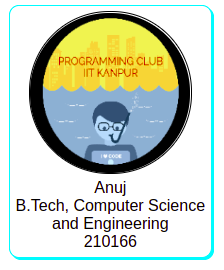

# anuj21S.github.io-task1
## Introduction
This webpage is built for the Revamp-search task (Task 1 of secy-recruitment tasks, PClub).
The aim is to create a __new and enchanced__ look for the student search website, with an added __family-tree__ integration.
## About Submission
1. The page is being deployed through GitHub Pages. [Click here](https://anuj21s.github.io/Revamp-search/) to view.
2. Currently, the page does not have the search options as the main focus of the task was to create UI design for the user cards and profiles.
3. The data used is mostly random except for a few students where data is taken from the student search itself.
4. The page also shows the family tree of the user on opening his profile (3 generations, the student's SG, student's brothers/sisters and the juniors under him if the student becomes an SG).
5. As of now, the webpage is best viewed on a laptop/PC only, however, we can set up responsive layouts in future if we really want to renew the student search.
## UI/UX design
* My own user card.   
  
* Example profile   
  
